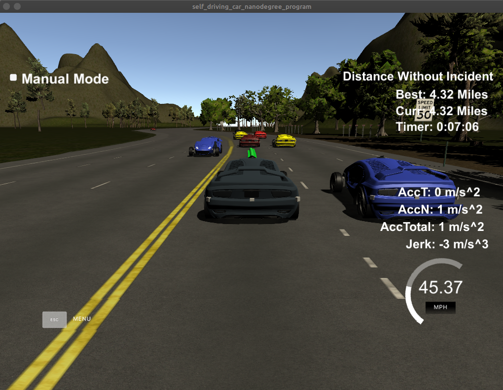
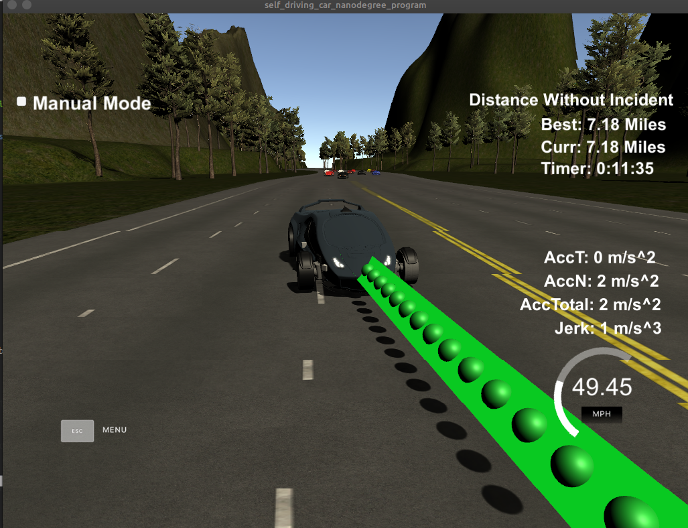

# CarND-Path-Planning-Project
Self-Driving Car Engineer Nanodegree Program

Project 1 - Path Planning

# Project Rubric

### Compilation

After cloning this repo.

```
1. Clone this repo.
2. Make a build directory: `mkdir build && cd build`
3. Compile: `cmake .. && make`
4. Run it: `./path_planning`.
```

### Path Planning Model

I have followed the QA session in the class and implemented following.
(https://www.youtube.com/watch?time_continue=2&v=7sI3VHFPP0w)

1.  Prediction and Decision based on environmental data

2.  Vehicle tragectory generation


### 1. Prediction and Decision
This step analyzes the localization and sensor fusion data for all cars on the same side of the track.

```
// Prediction.
bool car_ahead = false;
bool car_left = false;
bool car_right = false;
for ( int i = 0; i < sensor_fusion.size(); i++ ) {
    float d = sensor_fusion[i][6];
    int car_lane = -1;
    // is it on the same lane we are
    if ( d > 0 && d < 4 ) {
        car_lane = 0;
    } else if ( d > 4 && d < 8 ) {
        car_lane = 1;
    } else if ( d > 8 && d < 12 ) {
        car_lane = 2;
    }
    if (car_lane < 0) {
        continue;
    }
    // Find car speed.
    double vx = sensor_fusion[i][3];
    double vy = sensor_fusion[i][4];
    double check_speed = sqrt(vx*vx + vy*vy);
    double check_car_s = sensor_fusion[i][5];
    // Estimate car s position after executing previous trajectory.
    check_car_s += ((double)prev_size*0.02*check_speed);

    if ( car_lane == lane ) {
        // Car in our lane.
        car_ahead |= check_car_s > car_s && check_car_s - car_s < 30;
    } else if ( car_lane - lane == -1 ) {
        // Car left
        car_left |= car_s - 30 < check_car_s && car_s + 30 > check_car_s;
    } else if ( car_lane - lane == 1 ) {
        // Car right
        car_right |= car_s - 30 < check_car_s && car_s + 30 > check_car_s;
    }
}
```

Here, the positions of other vehicles are analysed relative to our vehicle, if our vehicle is within 30 metres of the vehicle in front, our car_ahead flag is set to true, If vehicles are within the margin on the left or right of our vehicle, car_left or car_right are set to true respectively.

```
// Behavior.
double speed_diff = 0;
const double MAX_SPEED = 49.5;
const double MAX_ACC = .224;
if ( car_ahead ) { // Car ahead
    if ( !car_left && lane > 0 ) {
    // if there is no car left and there is a left lane.
    lane--; // Change lane left.
    } else if ( !car_right && lane != 2 ){
    // if there is no car right and there is a right lane.
    lane++; // Change lane right.
    } else {
    speed_diff -= MAX_ACC;
    }
} else {
    if ( lane != 1 ) { // if we are not on the center lane.
    if ( ( lane == 0 && !car_right ) || ( lane == 2 && !car_left ) ) {
        lane = 1; // Back to center.
    }
    }
    if ( ref_vel < MAX_SPEED ) {
    speed_diff += MAX_ACC;
    }
}
```
Here, decisions are made on adjusting speed and changing lanes. If a car is ahead, the lanes to the left and right are checked.
If one of them is empty, the car will change lanes. Otherwise slow down.

The car will move back to the center lane when it becomes clear, this is because a car can move both left and right from the center lane, and it is more likely to get stuck if on the far left or right

If the area in front of the car is clear, the car will speed up.

### 2. Trajectory Generation
This step computes the trajectory of the vehicle from the decisions made above, the vehicle's position, and historical path points.

```
vector<double> ptsx;
vector<double> ptsy;

double ref_x = car_x;
double ref_y = car_y;
double ref_yaw = deg2rad(car_yaw);

// Do I have have previous points
if ( prev_size < 2 ) {
    // There are not too many...
    double prev_car_x = car_x - cos(car_yaw);
    double prev_car_y = car_y - sin(car_yaw);

    ptsx.push_back(prev_car_x);
    ptsx.push_back(car_x);

    ptsy.push_back(prev_car_y);
    ptsy.push_back(car_y);
} else {
    // Use the last two points.
    ref_x = previous_path_x[prev_size - 1];
    ref_y = previous_path_y[prev_size - 1];

    double ref_x_prev = previous_path_x[prev_size - 2];
    double ref_y_prev = previous_path_y[prev_size - 2];
    ref_yaw = atan2(ref_y-ref_y_prev, ref_x-ref_x_prev);

    ptsx.push_back(ref_x_prev);
    ptsx.push_back(ref_x);

    ptsy.push_back(ref_y_prev);
    ptsy.push_back(ref_y);
}

// Setting up target points in the future.
vector<double> next_wp0 = getXY(car_s + 30, 2 + 4*lane, map_waypoints_s, map_waypoints_x, map_waypoints_y);
vector<double> next_wp1 = getXY(car_s + 60, 2 + 4*lane, map_waypoints_s, map_waypoints_x, map_waypoints_y);
vector<double> next_wp2 = getXY(car_s + 90, 2 + 4*lane, map_waypoints_s, map_waypoints_x, map_waypoints_y);

ptsx.push_back(next_wp0[0]);
ptsx.push_back(next_wp1[0]);
ptsx.push_back(next_wp2[0]);

ptsy.push_back(next_wp0[1]);
ptsy.push_back(next_wp1[1]);
ptsy.push_back(next_wp2[1]);

// Making coordinates to local car coordinates.
for ( int i = 0; i < ptsx.size(); i++ ) {
    double shift_x = ptsx[i] - ref_x;
    double shift_y = ptsy[i] - ref_y;

    ptsx[i] = shift_x * cos(0 - ref_yaw) - shift_y * sin(0 - ref_yaw);
    ptsy[i] = shift_x * sin(0 - ref_yaw) + shift_y * cos(0 - ref_yaw);
}
```
The last two points of the previous trajectory (or the car position if there are no previous trajectory).
The Frenet helper function getXY() is used to generate three points spaced at evenly 30 metres in front of the car

The coordinates are transformed (shift and rotation) to local car coordinates to make them less complicated to the spine calculation

```
// Create the spline.
tk::spline s;
s.set_points(ptsx, ptsy);

// Output path points from previous path for continuity.
vector<double> next_x_vals;
vector<double> next_y_vals;
for ( int i = 0; i < prev_size; i++ ) {
    next_x_vals.push_back(previous_path_x[i]);
    next_y_vals.push_back(previous_path_y[i]);
}

// Calculate distance y position on 30 m ahead.
double target_x = 30.0;
double target_y = s(target_x);
double target_dist = sqrt(target_x*target_x + target_y*target_y);

double x_add_on = 0;

for( int i = 1; i < 50 - prev_size; i++ ) {
    ref_vel += speed_diff;
    if ( ref_vel > MAX_SPEED ) {
    ref_vel = MAX_SPEED;
    } else if ( ref_vel < MAX_ACC ) {
    ref_vel = MAX_ACC;
    }
    double N = target_dist/(0.02*ref_vel/2.24);
    double x_point = x_add_on + target_x/N;
    double y_point = s(x_point);

    x_add_on = x_point;

    double x_ref = x_point;
    double y_ref = y_point;

    x_point = x_ref * cos(ref_yaw) - y_ref * sin(ref_yaw);
    y_point = x_ref * sin(ref_yaw) + y_ref * cos(ref_yaw);

    x_point += ref_x;
    y_point += ref_y;

    next_x_vals.push_back(x_point);
    next_y_vals.push_back(y_point);
}
```
The computed waypoints are transformed using a spline. A spline easily computes a smooth trajectory in a 2D space while taking into account acceleration and velocity.

50 waypoints are generated in total. Because the length of the generated trajectory is variable, after the vehicle has assumed the correct position, the rest of the waypoints are generated to keep the vehicle in the target lane.


### Valid Trajectories

1. The car is able to drive at least 4.32 miles without incident.



The car reached 4.32 miles without incident at 7 min

2. The car drives according to the speed limit.

No speed limit violation happened.

3. Max Acceleration and Jerk are not Exceeded.

No max acceleration and jerk violation happened.

4. Car does not have collisions.

No collision happened.

5. The car stays in its lane, except for the time between changing lanes.

The car stayed its lane except when it had to change lane.

6. The car is able to change lanes


